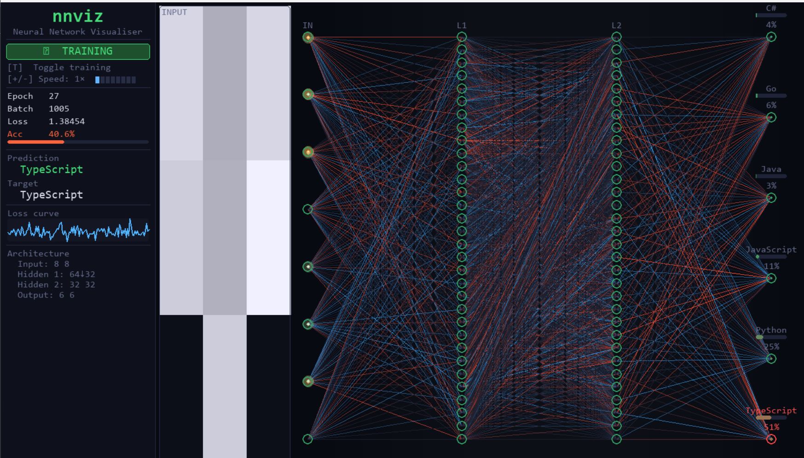
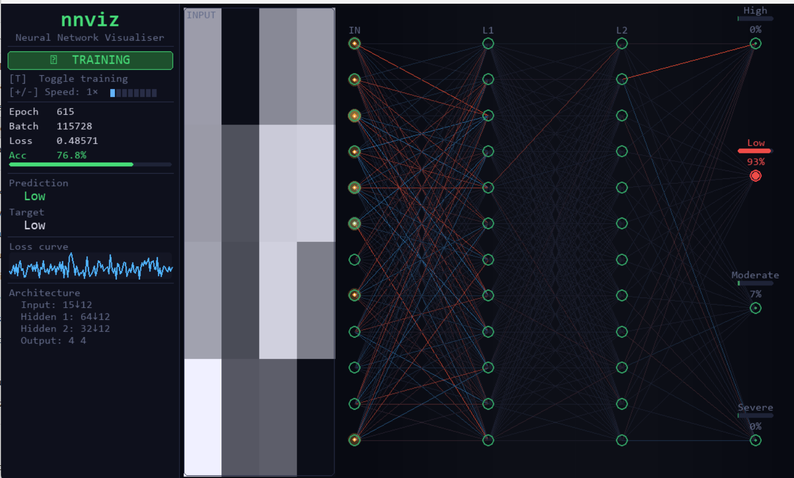

# nnviz — Neural Network Visualiser

[](https://pypi.org/project/nnviz-live/)
[](https://pypi.org/project/nnviz-live/)
[](LICENSE)

Live, real-time visualisation of PyTorch model training.  Watch weights update,
see predictions change, and understand what your network is learning — frame by frame.



*Multi-class text classification — watch the network weigh evidence toward each label in real time.*



*Same visualiser, different task — severity classification with live confidence bars.*

**[View on PyPI →](https://pypi.org/project/nnviz-live/)**

---

## Install

```bash
pip install nnviz-live
```

Need the example scripts too (they use pandas / scikit-learn)?

```bash
pip install "nnviz-live[examples]"
```

---

## Quickstart

```python
import torch.nn as nn, torch.optim as optim
from torch.utils.data import DataLoader, TensorDataset
from nnviz import Visualizer

# 1. Any model with nn.Linear layers
model = nn.Sequential(
    nn.Linear(784, 128), nn.ReLU(),
    nn.Linear(128,  64), nn.ReLU(),
    nn.Linear( 64,  10),
)

# 2. Any DataLoader that yields (X_batch, y_batch)
loader = DataLoader(TensorDataset(X_train, y_train), batch_size=64)

# 3. Run — a window opens, press T to start training
viz = Visualizer(
    input_shape  = (28, 28),                    # omit for tabular data
    class_names  = [str(i) for i in range(10)],
)
viz.run(model, loader, nn.CrossEntropyLoss(), optim.Adam(model.parameters()))
```

### Use it on any dataset

```python
viz = Visualizer(
    input_shape=None,           # None for tabular, (H, W) for images
    class_names=["cat", "dog"], # your label names
)
viz.run(model, your_loader, criterion, optimizer)
```

---

## Controls

| Key | Action |
|-----|--------|
| `T` or `Space` | Start / pause training |
| `+` / `-` | Speed up / slow down (batches per frame) |
| `Esc` | Quit |

---

## Visualiser parameters

| Parameter | Default | Description |
|-----------|---------|-------------|
| `input_shape` | `None` | `(H, W)` for image data; `None` for tabular |
| `class_names` | `None` | Human-readable label names for output layer |
| `max_visible_neurons` | `32` | Max neurons drawn per layer (large layers are sub-sampled — training is unaffected) |
| `width`, `height` | `1400, 820` | Window size in pixels |
| `fps` | `60` | Target frame rate |
| `batches_per_step` | `1` | Base batches trained per frame at speed 1× |
| `normalise_input` | `True` | Normalise pixel grid display to [0,1] per sample |

---

## What you see


**Left panel** — live stats: mode, epoch, batch count, loss, accuracy, current prediction vs target, and a live loss curve.

**Pixel grid** — the first sample of each batch, rendered as a greyscale image (or a square grid for tabular data).

**Network diagram** — every inter-layer connection coloured by weight sign and magnitude.  Blue = positive, red = negative, dark = near-zero (hidden so the display stays readable).  The highest-confidence output neuron glows red; others stay green.

---

## Demo video

[Watch a full training run](docs/demo-video.mp4)

*(GitHub doesn't preview `.mp4` inline in READMEs — click through to download/play, or drag the file into a GitHub PR/issue comment box to get an embeddable player link.)*

---

## Supported datasets

| Type | Works? | Notes |
|------|--------|-------|
| Image (MNIST, CIFAR-flat, …) | ✅ | Pass `input_shape=(H,W)` |
| Tabular (Iris, CSV, …) | ✅ | Leave `input_shape=None` |
| Multi-class classification | ✅ | Any number of output classes |
| Binary classification | ✅ | Use 2 output neurons + CrossEntropyLoss |
| Regression | ⚠️ | Renders, but accuracy stats won't be meaningful |

---

## Examples

```bash
python examples/mnist_example.py   # MNIST digits, image grid
python examples/iris_example.py    # Iris flowers, tabular
```

---

## Roadmap

- [x] Loss curve graph panel
- [ ] Save / load checkpoint from UI
- [ ] Activation heatmap overlay
- [ ] Multi-label classification support
- [x] PyPI release

---

## License

MIT